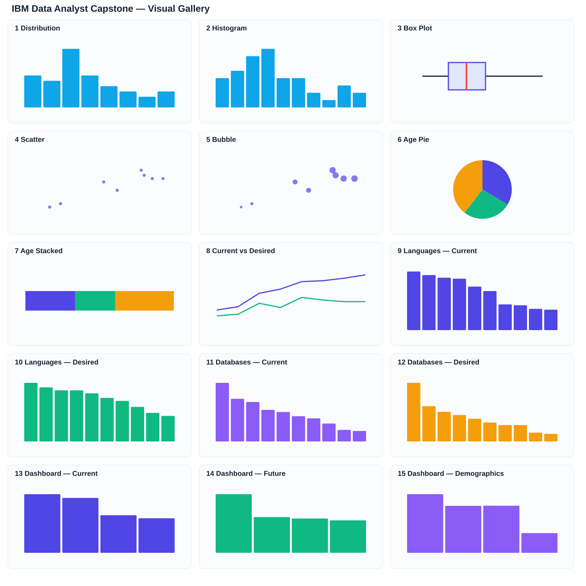

# IBM Data Analyst Capstone Project

<div align="center">

## Technology Trends from the 2025 Stack Overflow Developer Survey

**A complete IBM Data Analyst Professional Certificate capstone project by Aqib Hanif**


</div>

---

## Project Overview

This capstone project analyzes **current technology usage, future technology demand, database trends, development-tool adoption, and selected developer demographics** using the published **2025 Stack Overflow Developer Survey** results and public survey information.

The project follows the six-module workflow of the **IBM Data Analyst Professional Certificate** and demonstrates the complete analytics process: data collection concepts, data wrangling, exploratory data analysis, visualization, dashboard preparation, interpretation, and presentation of findings.

> **Important project note:** This notebook is a reconstructed source notebook created from the final capstone presentation, the course module structure, and the published technology values used in the final report. API access and web scraping are included as learning demonstrations; the final technology findings are based on the published survey results used in the presentation.

### Project at a glance

| Item | Value |
|---|---:|
| Survey | Stack Overflow Developer Survey 2025 |
| Responses | 49,000+ |
| Countries | 177 |
| Survey questions | 62 |
| Technologies represented | 314 |
| Main analysis table | 40 technology records |
| Programming-language views | Current + Desired |
| Database views | Current + Desired |
| Dashboard areas | Current Usage, Future Trends, Demographics |
| Author | Aqib Hanif |
| Program | IBM Data Analyst Professional Certificate |

---

## Repository Structure

```text
IBM-Data-Analyst-Capstone-Project/
│
├── Aqib_Hanif_IBM_Data_Analyst_Capstone_Project.ipynb
├── README.md
└── assets/
    └── project_visuals.svg
```

The **Jupyter notebook is the main project file**. The `assets/` folder contains only README visuals generated from the same values used in the notebook.

---

## Project Objectives

The analysis was designed to answer five practical questions:

1. Which programming languages are most widely used now?
2. Which programming languages are developers most interested in using next?
3. Which databases are strongest in current use and future interest?
4. What do the dashboard indicators reveal about modern development tools and developer demographics?
5. What practical skill combinations are most useful for students, analysts, educators, recruiters, and technology teams?

---

## Tools and Technologies

| Tool / Library | Purpose in this project |
|---|---|
| **Python** | Core analysis workflow |
| **Pandas** | DataFrames, cleaning, grouping, joining, CSV export |
| **NumPy** | Numerical operations and imputation demonstration |
| **Matplotlib** | Static visualizations |
| **Requests** | API-access demonstration |
| **BeautifulSoup** | Web-scraping demonstration |
| **Jupyter Notebook** | Analysis, documentation, code, and outputs |
| **CSV** | Dashboard-ready and reusable data exports |
| **IBM Cognos / Looker Studio concepts** | Dashboard preparation workflow covered by the capstone |

---

## End-to-End Analytics Workflow

```mermaid
flowchart LR
    A[Define Project Scenario] --> B[Collect / Reconstruct Data]
    B --> C[Explore Structure]
    C --> D[Clean & Wrangle]
    D --> E[Exploratory Data Analysis]
    E --> F[Visualize Findings]
    F --> G[Prepare Dashboard Data]
    G --> H[Interpret Results]
    H --> I[Present Findings]
```



---

# Module 1 — Data Collection

## 1.1 Project Scenario

The project treats the learner as a data analyst investigating which technologies matter **today** and which technologies developers want to use **in the near future**.

The analysis focuses on information that supports:

- career planning,
- technology learning priorities,
- hiring and workforce planning,
- curriculum development,
- and practical analytics decisions.

## 1.2 API Demonstration

The notebook includes a disabled-by-default demonstration using the public **Stack Exchange API**. It shows how Python can request structured web data using `requests` without making the capstone dependent on live internet access.

## 1.3 Web Scraping Demonstration

A second disabled-by-default learning example demonstrates how `requests` and `BeautifulSoup` can read information from HTML. This is included to show the course technique; it is **not presented as the source of the final survey trend values**.

## 1.4 Reconstructed Analysis Tables

Four core tables are built for analysis:

- current programming languages,
- desired programming languages,
- current databases,
- desired databases.

These are combined into one long-form table with the fields:

`Technology`, `Percent`, `Category`, and `Period`.

---

# Module 2 — Data Wrangling

The notebook demonstrates the complete cleaning process expected in the capstone.

## Cleaning steps performed

| Step | What was done |
|---|---|
| Duplicate detection | Checked complete rows using `duplicated()` |
| Duplicate removal | Applied `drop_duplicates()` and reset the index |
| Missing-value check | Counted null values by column |
| Imputation demonstration | Created a temporary missing value and filled it using a statistical rule |
| Normalization | Applied min-max normalization to percentage values |
| Text standardization | Removed unnecessary whitespace from technology names |
| Sorting | Organized records for easier analysis and interpretation |

The final combined analysis table contains **40 records**: 10 current languages, 10 desired languages, 10 current databases, and 10 desired databases.

---

# Module 3 — Exploratory Data Analysis

## Descriptive summary

Across the 40 technology-percentage records:

| Statistic | Percent |
|---|---:|
| Count | 40 |
| Mean | 29.97% |
| Standard deviation | 15.53 |
| Minimum | 6.00% |
| Q1 | 18.75% |
| Median | 28.00% |
| Q3 | 37.88% |
| Maximum | 66.00% |

## Outlier analysis

The IQR method was used:

- **Q1:** 18.75
- **Q3:** 37.875
- **IQR:** 19.125
- **Lower bound:** -9.9375
- **Upper bound:** 66.5625

No IQR outliers were identified in this presentation snapshot.

## Correlation analysis

Only technologies appearing in both the current and desired lists were compared.

| Comparison | Correlation |
|---|---:|
| Programming languages: Current vs Desired | **0.912** |
| Databases: Current vs Desired | **0.921** |

These strong positive relationships suggest that technologies already used widely also tend to attract meaningful future interest, while still allowing emerging technologies to gain attention.

## EDA Visuals

The notebook uses both an exploratory distribution histogram and a formal histogram, plus a box plot for spread and possible outliers.

---

# Module 4 — Data Visualization

The visualization module intentionally demonstrates multiple chart types and explains when each is appropriate.

## 4.1 Histogram

Used to show how technology percentages are distributed across low, medium, and high values.

## 4.2 Box Plot

Used to summarize median, interquartile spread, total spread, and possible outliers.

## 4.3 Scatter Plot

Compares current and desired percentages for programming languages appearing in both lists.

## 4.4 Bubble Plot

Extends the scatter plot by using the average of current and desired percentages as bubble size, demonstrating how a third numerical variable can be encoded visually.

## 4.5 Pie Chart

Because technology survey questions are multi-select, technology percentages are **not incorrectly forced into a pie chart**. Instead, the notebook uses age composition, which can be represented as parts of a whole.

## 4.6 Stacked Chart

The same age composition is shown as a 100% stacked bar so the part-to-whole interpretation remains valid.

## 4.7 Line Chart

A line chart is included as a course exercise for common languages across the two survey states. It is not presented as a true time-series analysis.

---

## Complete Visual Gallery

The following gallery contains **all 15 project visuals** represented from the notebook: two histograms, box plot, scatter plot, bubble plot, pie chart, 100% stacked chart, line chart, current/desired programming-language charts, current/desired database charts, and the three dashboard views.



# Programming Language Trends

## Current Programming Languages

| Rank | Technology | Current usage |
|---:|---|---:|
| 1 | JavaScript | **66.0%** |
| 2 | HTML/CSS | **62.0%** |
| 3 | SQL | **59.0%** |
| 4 | Python | **57.9%** |
| 5 | Bash/Shell | **49.0%** |
| 6 | TypeScript | **44.0%** |
| 7 | Java | **29.0%** |
| 8 | C# | **28.0%** |
| 9 | C++ | **24.0%** |
| 10 | PowerShell | **23.0%** |

## Desired Programming Languages

| Rank | Technology | Desired usage |
|---:|---|---:|
| 1 | Python | **39.0%** |
| 2 | SQL | **36.0%** |
| 3 | JavaScript | **34.0%** |
| 4 | HTML/CSS | **34.0%** |
| 5 | TypeScript | **32.0%** |
| 6 | Rust | **29.0%** |
| 7 | Bash/Shell | **27.0%** |
| 8 | Go | **23.0%** |
| 9 | C# | **19.0%** |
| 10 | C++ | **17.0%** |

## Language findings

- **JavaScript** has the highest current usage in the project snapshot at **66.0%**.
- **Python** is already highly used at **57.9%** and becomes the top desired language at **39.0%**.
- **SQL** remains strong in both current and desired views.
- **TypeScript** has substantial current usage and future interest.
- **Rust** and **Go** appear in the desired top 10, signaling interest in modern systems and backend development.
- The practical takeaway is not to chase one language in isolation; a stronger foundation combines **Python + SQL + JavaScript/TypeScript awareness**.

---

# Database Trends

## Current Databases

| Rank | Database | Current usage |
|---:|---|---:|
| 1 | PostgreSQL | **55.7%** |
| 2 | MySQL | **40.5%** |
| 3 | SQLite | **37.5%** |
| 4 | SQL Server | **30.0%** |
| 5 | Redis | **28.0%** |
| 6 | MongoDB | **24.0%** |
| 7 | MariaDB | **22.0%** |
| 8 | Elasticsearch | **17.0%** |
| 9 | Oracle | **11.0%** |
| 10 | DynamoDB | **10.0%** |

## Desired Databases

| Rank | Database | Desired usage |
|---:|---|---:|
| 1 | PostgreSQL | **46.5%** |
| 2 | SQLite | **28.0%** |
| 3 | Redis | **23.5%** |
| 4 | MySQL | **21.0%** |
| 5 | MongoDB | **18.0%** |
| 6 | SQL Server | **15.0%** |
| 7 | MariaDB | **13.0%** |
| 8 | Elasticsearch | **13.0%** |
| 9 | DynamoDB | **7.0%** |
| 10 | Supabase | **6.0%** |

## Database findings

- **PostgreSQL** is the strongest database signal in both current use and desired interest.
- PostgreSQL reaches **55.7% current usage** and **46.5% desired interest** in the project snapshot.
- **MySQL** and **SQLite** remain important for practical relational-database work.
- **Redis** shows notable future interest, supporting its relevance in caching, fast data access, and modern applications.
- **MongoDB** remains relevant for document-oriented application workloads.

---

# Module 5 — Dashboard Preparation

The notebook prepares three dashboard-ready sections and exports them as CSV files when run.

## Current Technology Usage

| Technology | Percent |
|---|---:|
| VS Code | **75.9%** |
| Docker | **71.1%** |
| Node.js | **48.7%** |
| React | **44.7%** |

## Future Technology Trends

| Technology | Percent |
|---|---:|
| Docker | **50.4%** |
| React | **30.7%** |
| AWS | **29.5%** |
| Kubernetes | **27.9%** |

## Developer Demographics

| Measure | Percent |
|---|---:|
| Age 25–34 | **33.6%** |
| Age 35–44 | **26.9%** |
| Full-stack role | **27.0%** |
| Student role | **11.3%** |

## Dashboard interpretation

- **VS Code** and **Docker** dominate the selected current-usage indicators.
- **Docker** also leads the selected future-technology indicators, showing sustained relevance.
- **React**, **AWS**, and **Kubernetes** reinforce the importance of web, cloud, and cloud-native skills.
- The demographic snapshot shows a strong concentration in the **25–34** and **35–44** age groups.
- The dashboard is designed to convert detailed tables into decision-friendly summaries.

### Dashboard-ready files generated by the notebook

When the notebook is executed, it creates:

```text
capstone_outputs/
├── dashboard_current_technology_usage.csv
├── dashboard_future_technology_trends.csv
└── dashboard_demographics.csv
```

The notebook also contains an optional Plotly interactive-bar demonstration. It is disabled by default and is not presented as a replacement for the Cognos/Looker Studio dashboard task.

---

# Module 6 — Presenting Findings

## Executive Summary

The analysis shows a stable technology core with growing interest around **Python, PostgreSQL, cloud-native tools, modern development workflows, and database skills**.

A practical learning stack emerging from the analysis is:

> **Python + SQL + PostgreSQL + data visualization/dashboarding + cloud awareness**

For broader software and analytics environments, **JavaScript/TypeScript awareness** also remains valuable.

## Overall Findings and Practical Implications

| Finding | Evidence | Practical implication |
|---|---|---|
| Python + SQL remain essential | Both rank strongly in current and desired language usage | Strong foundation for analytics, automation, and AI-related projects |
| PostgreSQL leads database trends | Highest current and desired database percentage | Important relational database skill for modern data work |
| Cloud-native tools matter | Docker, AWS, and Kubernetes appear in future-trend indicators | Analysts increasingly benefit from deployment and cloud awareness |
| Modern web tools remain relevant | JavaScript, TypeScript, React, Node.js stay prominent | Useful for dashboards, data products, and full-stack analytics environments |
| Visualization converts analysis into decisions | Multiple plots and dashboard-ready outputs are produced | Communication is a core data-analyst skill, not an optional extra |

## Final Conclusion

The project supports one central conclusion: **technology skills are most valuable when they are combined into a practical analytical workflow rather than learned independently**.

For a data-focused career, the strongest foundation is:

- Python for analysis and automation,
- SQL for querying and structured data,
- PostgreSQL and relational-database concepts,
- visualization and dashboard storytelling,
- and growing awareness of cloud and AI-enabled workflows.

---

# How to Run the Project

## 1. Clone the repository

```bash
git clone https://github.com/aqibhanifai/IBM-Data-Analyst-Capstone-Project.git
cd IBM-Data-Analyst-Capstone-Project
```

## 2. Install the main Python packages

```bash
pip install pandas numpy matplotlib requests beautifulsoup4 jupyter
```

Optional interactive chart support:

```bash
pip install plotly
```

## 3. Launch Jupyter Notebook

```bash
jupyter notebook
```

Open:

```text
Aqib_Hanif_IBM_Data_Analyst_Capstone_Project.ipynb
```

## 4. Run the notebook from top to bottom

The notebook creates a `capstone_outputs/` directory and exports the main reusable tables and dashboard-ready CSV files.

---

# Main Output Files Produced by the Notebook

```text
capstone_outputs/
├── technology_trends_reconstructed.csv
├── languages_current.csv
├── languages_desired.csv
├── databases_current.csv
├── databases_desired.csv
├── dashboard_current_technology_usage.csv
├── dashboard_future_technology_trends.csv
├── dashboard_demographics.csv
├── distribution_histogram.png
├── histogram.png
├── box_plot.png
├── scatter_current_vs_desired_languages.png
├── bubble_plot_languages.png
├── pie_age_composition.png
├── stacked_age_composition.png
├── line_current_vs_desired_languages.png
├── languages_current_bar.png
├── languages_desired_bar.png
├── databases_current_bar.png
└── databases_desired_bar.png
```

---

# Skills Demonstrated

- Data collection concepts
- API requests
- Web scraping concepts
- DataFrame construction
- Data exploration
- Duplicate detection and removal
- Missing-value analysis
- Imputation
- Min-max normalization
- Data cleaning and standardization
- Descriptive statistics
- Distribution analysis
- IQR outlier detection
- Data merging
- Correlation analysis
- Histogram visualization
- Box plots
- Scatter plots
- Bubble plots
- Pie charts
- 100% stacked charts
- Line charts
- Bar charts
- Dashboard-data preparation
- CSV export
- Insight generation
- Business interpretation
- Technical storytelling
- Reproducible Jupyter workflow

---

# Project Limitations and Transparency

This repository is intentionally transparent about the reconstruction process.

- The source notebook was rebuilt after the original notebook was accidentally deleted.
- Final trend values are kept consistent with the published values used in the final capstone presentation.
- API and scraping cells are **learning demonstrations** and are disabled by default.
- Current vs desired is a comparison of survey states, not a formal longitudinal time series.
- The compact technology tables represent the top values used in the final presentation rather than the full raw survey dataset.

These limitations are documented so the project remains academically clear and reproducible.

---

# Author

**Aqib Hanif**  
IBM Data Analyst Professional Certificate  
Data Analytics • Statistics • Data Science • Machine Learning

GitHub: [@aqibhanifai](https://github.com/aqibhanifai)

---

<div align="center">

### IBM Data Analyst Capstone Project
**From data collection and cleaning to visualization, dashboard preparation, and decision-oriented findings.**

</div>
